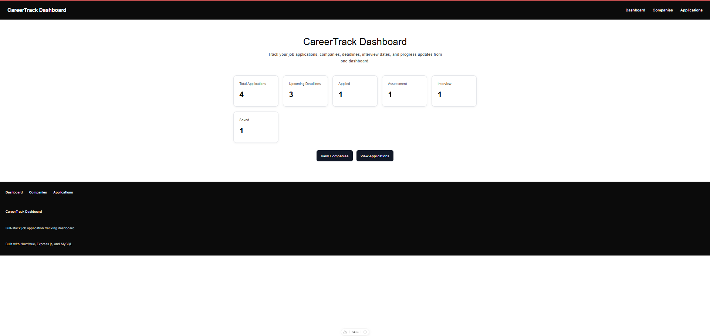
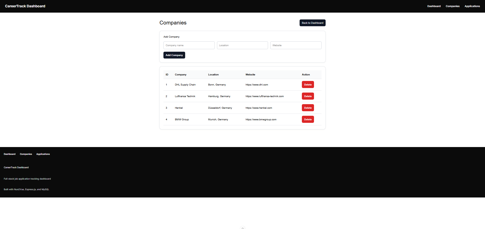
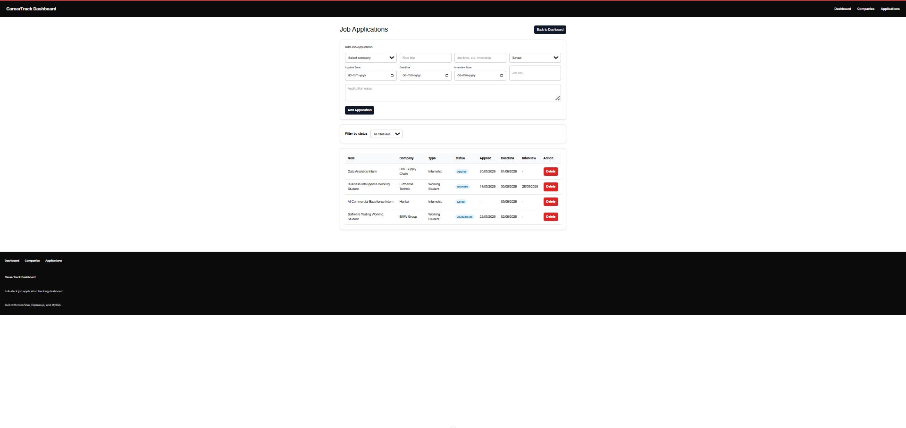
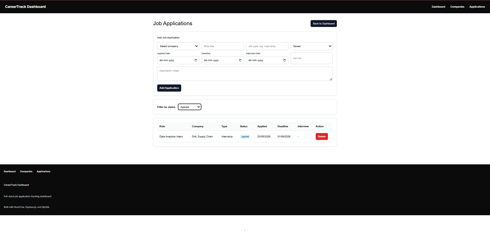
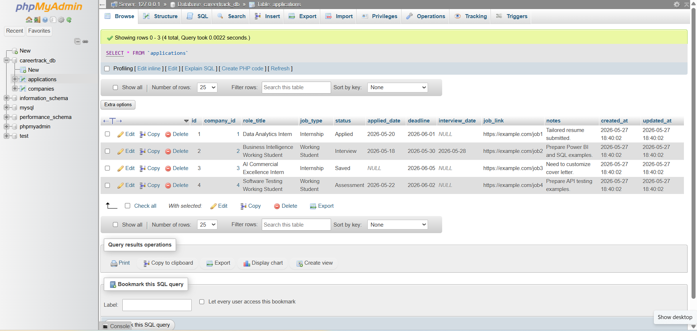

# CareerTrack Dashboard

CareerTrack Dashboard is a full-stack job application tracking web application built with Nuxt/Vue, Node.js, Express.js, and MySQL/MariaDB. It helps users manage companies, job applications, statuses, deadlines, interview dates, job links, and application notes from one centralized dashboard.

This project was built as a portfolio project to demonstrate practical full-stack development skills, including frontend development, REST API design, relational database modeling, CRUD workflows, filtering, and dashboard reporting.

---

## Features

- Dashboard KPI cards for total applications, status counts, and upcoming deadlines
- Company management with add, view, and delete functionality
- Job application management with add, view, delete, and status filtering
- Tracks company, role title, job type, status, applied date, deadline, interview date, job link, and notes
- REST API built with Node.js and Express.js
- MySQL/MariaDB relational database with `companies` and `applications` tables
- Frontend-backend integration using Axios
- Responsive Nuxt/Vue interface
- Clean project documentation with setup instructions and screenshots

---

## Tech Stack

### Frontend

- Nuxt/Vue
- Axios
- CSS

### Backend

- Node.js
- Express.js
- MySQL2
- CORS
- dotenv
- Nodemon

### Database

- MySQL/MariaDB
- XAMPP
- phpMyAdmin

---

## Project Structure

```text
careertrack-dashboard/
├── api-server/
│   ├── config/
│   ├── controllers/
│   ├── routes/
│   ├── .env.example
│   ├── index.js
│   ├── package.json
│   └── package-lock.json
│
├── client/
│   ├── app/
│   ├── public/
│   ├── server/
│   ├── utils/
│   ├── nuxt.config.ts
│   ├── package.json
│   └── package-lock.json
│
├── database/
│   ├── schema.sql
│   └── seed.sql
│
├── screenshots/
├── README.md
└── .gitignore
```

---

## Screenshots

### Dashboard



### Companies Page



### Applications Page



### Status Filter



### phpMyAdmin Applications Table



---

## Database Design

The project uses one database:

```text
careertrack_db
```

It contains two main tables:

```text
companies
applications
```

### companies table

| Column | Description |
|---|---|
| `id` | Primary key |
| `company_name` | Company name |
| `location` | Company location |
| `website` | Company website |
| `created_at` | Created timestamp |

### applications table

| Column | Description |
|---|---|
| `id` | Primary key |
| `company_id` | Foreign key connected to companies |
| `role_title` | Job role title |
| `job_type` | Internship, Working Student, Full-time, etc. |
| `status` | Saved, Applied, Interview, Assessment, Offer, Rejected |
| `applied_date` | Date of application |
| `deadline` | Application deadline |
| `interview_date` | Interview date |
| `job_link` | Job posting link |
| `notes` | Application notes |
| `created_at` | Created timestamp |
| `updated_at` | Updated timestamp |

The `applications` table is connected to the `companies` table using a foreign key:

```sql
FOREIGN KEY (company_id) REFERENCES companies(id) ON DELETE SET NULL
```

This means that if a company is deleted, related applications remain in the system, but their company reference becomes empty.

---

## API Endpoints

### Companies

| Method | Endpoint | Description |
|---|---|---|
| `GET` | `/api/companies` | Get all companies |
| `GET` | `/api/companies/:id` | Get one company by ID |
| `POST` | `/api/companies` | Create a new company |
| `PUT` | `/api/companies/:id` | Update an existing company |
| `DELETE` | `/api/companies/:id` | Delete a company |

### Applications

| Method | Endpoint | Description |
|---|---|---|
| `GET` | `/api/applications` | Get all applications |
| `GET` | `/api/applications?status=Applied` | Filter applications by status |
| `GET` | `/api/applications/:id` | Get one application by ID |
| `POST` | `/api/applications` | Create a new application |
| `PUT` | `/api/applications/:id` | Update an existing application |
| `DELETE` | `/api/applications/:id` | Delete an application |

### Dashboard

| Method | Endpoint | Description |
|---|---|---|
| `GET` | `/api/dashboard/stats` | Get dashboard statistics |

---

## Local Setup

### Prerequisites

Install the following before running the project:

- Node.js
- npm
- XAMPP
- VS Code or any code editor

---

### 1. Clone the repository

```bash
git clone https://github.com/praveenrajece2018-code/careertrack-dashboard.git
cd careertrack-dashboard
```

---

### 2. Set up the database

Start XAMPP and enable:

```text
Apache
MySQL
```

Open phpMyAdmin:

```text
http://localhost/phpmyadmin
```

Run the SQL files in this order:

```text
database/schema.sql
database/seed.sql
```

This will create the `careertrack_db` database and insert sample records.

---

### 3. Configure backend environment

Inside the `api-server` folder, create a `.env` file:

```env
PORT=5000
DB_HOST=localhost
DB_USER=root
DB_PASSWORD=your_password
DB_NAME=careertrack_db
```

For default XAMPP installations, the MySQL password may be empty:

```env
DB_PASSWORD=
```

A sample file is provided here:

```text
api-server/.env.example
```

---

### 4. Install and run the backend

Open a terminal:

```bash
cd api-server
npm install
npm run dev
```

The backend runs at:

```text
http://localhost:5000
```

Example API check:

```text
http://localhost:5000/api/applications
```

---

### 5. Install and run the frontend

Open another terminal:

```bash
cd client
npm install
npm run dev
```

The frontend runs at:

```text
http://localhost:3000
```

---

## Usage

After starting XAMPP, backend, and frontend:

1. Open the dashboard at `http://localhost:3000`
2. View total applications, upcoming deadlines, and status counts
3. Open the Companies page to add or delete companies
4. Open the Applications page to add, delete, or filter job applications
5. Verify saved data in phpMyAdmin under `careertrack_db`

---

## Future Improvements

- Add edit functionality in the frontend
- Add authentication and user-specific dashboards
- Add Kanban board view by application status
- Add CSV export for job applications
- Add charts for monthly application trends
- Add deadline reminders
- Deploy frontend and backend
- Add validation and toast notifications

---

## Project Purpose

This project was created to demonstrate hands-on full-stack development ability using Nuxt/Vue, Node.js, Express.js, and MySQL. It shows practical implementation of CRUD operations, REST API integration, relational database design, status filtering, and dashboard reporting in a job application tracking use case.

---

## Author

**Praveen Raj**  
M.Sc. Data Analytics and Decision Science  
RWTH Aachen University
